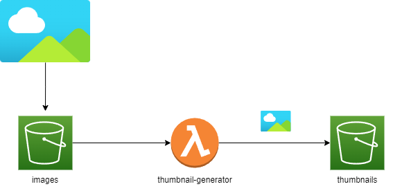

# AWS Thumbnail Generator

## Requirements

Install Serverless Framework
```
npm install -g serverless@3
```

[Install AWS CLI](https://docs.aws.amazon.com/cli/latest/userguide/getting-started-install.html) and configure the credentials.

[Install SAM](https://docs.aws.amazon.com/serverless-application-model/latest/developerguide/install-sam-cli.html) according
to the operating system.

Create the bucket for deployments
```
aws s3 create-bucket --bucket deployment-bucket --acl private
```

## Deployment

To create the buckets for the images and the thumbnails, we have to build and deploy SAM with the
Cloudformation template inside `templates/s3.yml`

```
sam build -t templates/s3.yml --use-container
```
```
sam deploy --region {{ AWS_REGION }} \
            --stack-name thumbnail-buckets-{{ STAGE }} \
            --capabilities CAPABILITY_NAMED_IAM \
            --parameter-overrides "Stage={{ STAGE }}" \
            --s3-bucket deployment-bucket \
            --s3-prefix sam \
            --no-confirm-changeset \
            --no-fail-on-empty-changeset \
            --force-upload
```

Now let's install the serverless-python-requirements plugin
```
serverless plugin install --name serverless-python-requirements
```

Finally, we can deploy the Lambda Function
```
serverless deploy --stage {{ STAGE }} --region {{ AWS_REGION }} --force --verbose
```

## Operation

The function `thumbnail-generator` will we triggered every time an image arrives to the bucket
`images`, then will run a process to generate the thumbnail and save it to the bucket `thumbnails`
with the same name as the original image plus a `_thumbnail` suffix.



The default size of the thumbnail is 90x90, but it can be changed in the `functions/config.yml` file.

This architecture has the advantage that it runs automatically as the images arrive in the bucket
and after that, you can download the thumbnail from the thumbnails bucket. The function returns the URI so
that it can be easy to find the thumbnail.

The weaknesses are that it only supports .png and .jpg formats, but this can be changed in the `functions/config.yml`
considering the limitations of the [Pillow](https://pillow.readthedocs.io/en/stable/) package, and also
the bucket `deployment-bucket` has to be created before.

